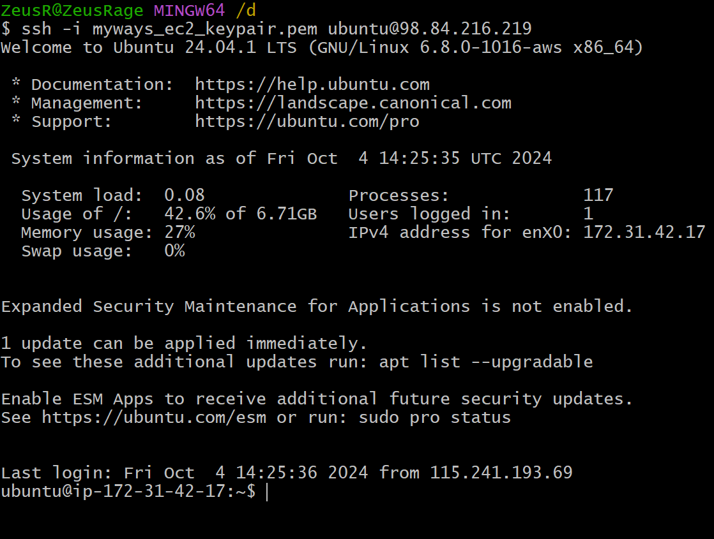
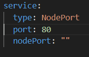
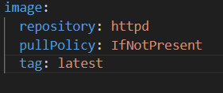
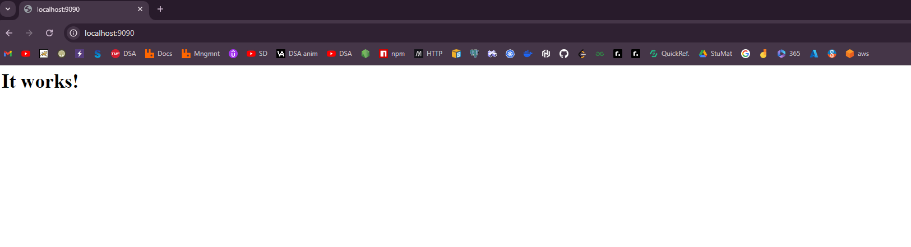
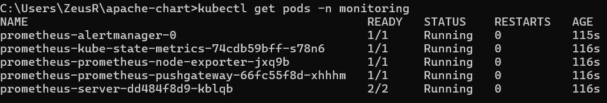
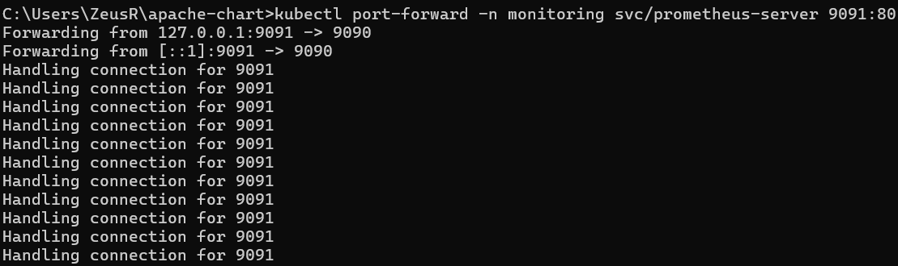
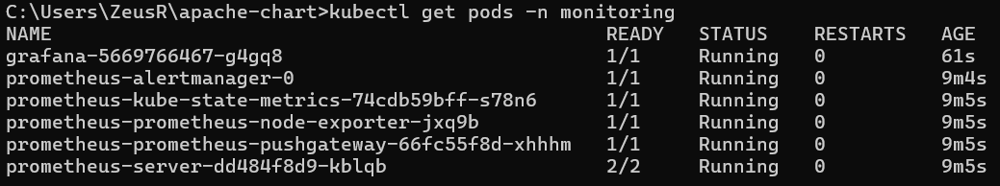
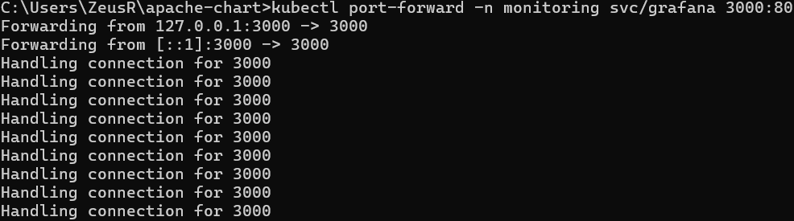
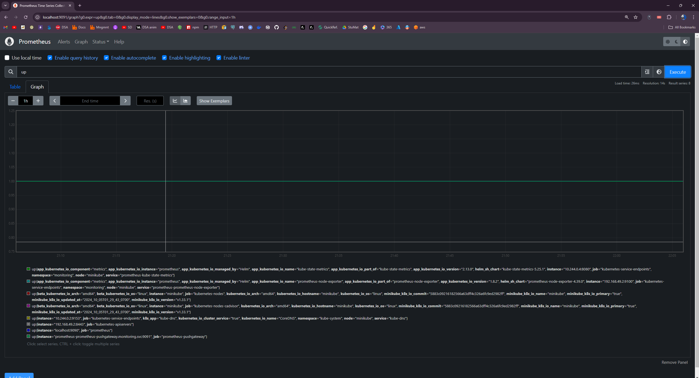
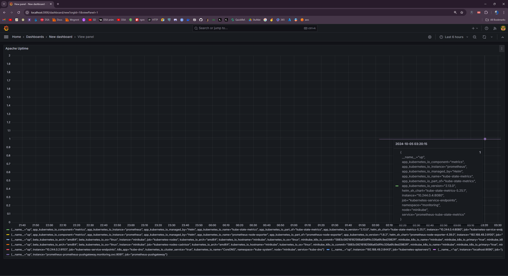

# MyWays.ai Assignment: Platform Engineer Intern Assignment

## Table of Contents
1. [Part 1: Infrastructure Deployment Using Terraform](#part-1-infrastructure-deployment-using-terraform)
    - [Services Used](#services-used-in-the-assignment-with-their-roles)
    - [Command Execution](#command-execution)
    - [Execution Flow](#execution-flow)
    - [Results](#results)
2. [Part 2: Application Deployment on Kubernetes Using Helm](#part-2-application-deployment-on-kubernetes-using-helm)
    - [Set Up Kubernetes Environment (Minikube)](#set-up-kubernetes-environment-minikube)
    - [Containerizing the Apache Server using Helm](#containerizing-the-apache-server-using-helm)
    - [Prometheus Setup](#setting-up-the-monitoring-with-prometheus)
    - [Grafana Setup](#setting-up-visualization-using-grafana)
    - [Add Promrtheus as a Data Source](#add-prometheus-as-a-data-source)
    - [Prometheus Dashboard](#dashboard-of-prometheus-after-successfull-execution)
    - [Grafana Dashboard](#dashboard-of-grafana-after-successfull-execution)

---
# Part 1: Infrastructure Deployment Using Terraform
## Application: Cloud-based document processing.

I made  a cloud-based processing and review of documents application involving the use of multiple AWS services, along with Python automation. The system processes the uploaded document, be it an invoice, contract, or anything else, and saves the department-specific processed data in the cloud. For setting up the cloud infrastructure I have used a terraform script Here I took the Finance department which only deals with the amount to be paid, vendor’s account number and his name; every other information is secondary to it, the main focus lies on these 3 things.
With that, here is a breakdown of all the services used and their roles.

## Services used in the assignment with their roles.

<strong>Terraform (for Infrastructure-as-Code):</strong> 

This includes automating the deployment and management of AWS infrastructure, including S3 buckets, SQS queues, and EC2 instances, among other necessary resources.

How it's used:Terraform will provide the cloud infrastructure, and everything from S3 to SQS, EC2, right down to Secrets Manager will be correctly implemented and will, consequently, maintain state management.

<strong>Amazon S3: Simple Storage Service</strong>

Use the original documents (for example, PDFs) for uploading the invoice.

How it's used:

Files such as `SampleInvoice.pdf` would be stored in an S3 bucket, `myways-s3-bucket-2184`
It stores the department-raw processed data into the S3 bucket under particular folders, such as `processed/finance/`, right after processing.

If the Invoice is in your local desktop(not on the ec2 instance) then copy your file to the ec2 instance using the below command.

`scp -i /path/to/your/key_pair.pem "D:\SampleInvoice.pdf" ubuntu@<ec2-public-ip>:/home/ubuntu/`

Upload the pdf file from your ec2 instance to the s3 bucket using the below command.

`aws s3 cp /home/ubuntu/SampleInvoice.pdf s3://myways-s3-bucket-2184/`

For verification of the file use the below command.

`aws s3 ls s3://myways-s3-bucket-2184/`

<strong>Amazon SQS: Simple Queue Service</strong>

This queuing service decouples requests for document processing by storing messages that contain the information on which document to process and enabling asynchronous processing.

How it is used:

An SQS queue named `document-processing-queue_2184` is written to, with message details about which S3 bucket and file , in this case `SampleInvoice.pdf`.

The feature should be used when retrieving the message from the SQS queue and processing the document through an application or Python script; afterwards, the message should be deleted.

`aws sqs send-message --queue-url https://sqs.us-east-1.amazonaws.com/3240XXXXX890/document-processing-queue_2184 \ --message-body "{\"bucket_name\":\"myways-s3-bucket-2184\", \"file_key\":\"SampleInvoice.pdf\"}" --region us-east-1`

<strong>AWS Textract</strong> 

AWS Extract is used for the extraction of text, data, or metadata from documents, such as invoices and contracts.

How it is used:

The Python script, `document_processing.py`, processes the document recovered from S3 using AWS Textract for document processing.
The departmental output can be detected to be transformed into different form.

<strong>AWS Secrets Manager</strong> 

Secret Manager is used for storing and managing sensitive credentials like AWS API keys, database credentials, etc., needed by the application securely.

How it is used:

TThe Python script document_processing.py  needs access to AWS services (S3, SQS, Textract). Instead of embedding AWS Access Keys and Secret Keys into the script, Secrets Manager stores these credentials securely.The application retrieves the AWS credentials at runtime from Secrets Manager to authenticate API calls to various AWS services.

<strong>AWS EC2: Elastic Compute Cloud</strong> 

Ec2 does the document processing service on this host. The EC2 instance runs the Python script which automates the workflow, reading SQS messages, processing documents, and saving results.

How it is used:

The Ubuntu-based EC2 actually executes the script, called `document_processing.py`, that coordinates all of the work, including retrieving a document from S3, processing it using Textract, and saving results back to S3.

You SSH to an EC2 instance and run your commands in a managed environment.

`python3` and a virtual environment `myenv` is where all the necessary packages, including `boto3`, are to be installed in managing the environment.

## Command Execution

After the whole infrastructure of aws is set-up using the `main.tf` script, here are the commands that I have executed one-by-one for managing and using the services.

### ssh into the aws ec2 instance

`ssh -i myways_ec2_keypair.pem ubuntu@<public_ip_of_ubuntu_instance>`

### Install python3 and Pip

`sudo apt install python3 python3-pip`

### Set Up Python Virtual Environment

`python3 -m venv myenv`
`source myenv/bin/activate`

### Install the aws cli on the ec2 instance

`curl "https://awscli.amazonaws.com/awscli-exe-linux-x86_64.zip" -o "awscliv2.zip"`

* ##### Unzip the installer

`sudo apt-get install unzip -y`

* ##### Run the AWS CLI installer

`sudo ./aws/install`

* ##### Verify the Installation

`aws --version`

### Configure AWS CLI

`aws configure`
###### Enter your AWS Access Key ID, AWS Secret Access Key, Default region, and Default output format when prompted,using the IAM role and in the Users section, generate the access keys

### Activate Virtual Environment

`source myenv/bin/activate`

### Install dependencies like boto3 inside the python virtual environment

`pip install boto3`

### Make python script named `document_processing.py`

`vim document_processing.py`

######	After creating the .py script, paste the code provided in the github repository.

### Upload the pdf file to the s3 bucket

`aws s3 cp SampleInvoice.pdf s3://myways-s3-bucket-2184/`

### Send message to the SQS Queue

`aws sqs send-message --queue-url https://sqs.us-east-1.amazonaws.com/3240XXXXX890/document-processing-queue_2184 \ --message-body "{\"bucket_name\":\"myways-s3-bucket-2184\", \"file_key\":\"SampleInvoice.pdf\"}" --region us-east-1`

### Run the Document Processing Script

`python3 document_processing.py`

### Verify the processed data in the s3 bucket

`aws s3 ls s3://myways-s3-bucket-2184/processed/finance/`

### Download the Processed Data

`aws s3 cp s3://myways-s3-bucket-2184/processed/finance/finance_data.json`

### View the Processed Data

`cat finance_data.json`
## Execution Flow

* #### Document Upload
&nbsp;&nbsp;&nbsp;&nbsp;&nbsp;&nbsp;&nbsp;Document Upload: A document (e.g., `SampleInvoice.pdf`) is uploaded to the S3 bucket (`myways-s3-bucket-2184`).

* #### SQS Message sent
&nbsp;&nbsp;&nbsp;&nbsp;&nbsp;&nbsp;&nbsp;A message is being sent to the SQS queue document-processing-queue_2184 with a bucket and file key of the uploaded document.

* #### Transaction processing:
&nbsp;&nbsp;&nbsp;&nbsp;&nbsp;&nbsp;&nbsp;The `document_processing.py` script runs on an EC2 instance.
It retrieves the SQS message, downloads a document from an S3 bucket, and then processes it through AWS Textract or similar tools.
The extracted data is converted into department-specific outputs, such as the finance department seeing amount and vendor information.

* #### Save Processed Data
&nbsp;&nbsp;&nbsp;&nbsp;&nbsp;&nbsp;&nbsp;The processed data (e.g., `finance_data.json`) are stored back in a different location in the S3 bucket (`processed/finance/`).

* #### Deletion of SQS Message
&nbsp;&nbsp;&nbsp;&nbsp;&nbsp;&nbsp;&nbsp;The SQS message is deleted after processing the document, hence complete work task.

## Results

* #### SSH into the ec2 instance locally

* #### Activating the python virtual environment.

* #### Uploading the file to the s3 bucket.

* #### Sending message to SQS Queue.

* #### Run the Document Processing Script.

* #### Verifying the Processed Data in S3.

* #### Downloading the Processed Data for Review.

* ####  Viewing the Processed Data.

# Part 2: Application Deployment on Kubernetes Using Helm
## Application: Apache

I am deploying an Apache server on a Kubernetes cluster, monitoring it using Prometheus and Grafana, and configuring dashboards to visualize performance data.

## Set Up Kubernetes Environment (Minikube)

Note: Already installed minikube and kubectl.

Start minikube using the command: 
`minikube start`

Verify setup by running the command:
`kubectl get nodes`

## Containerizing the Apache Server using Helm

Create helm chart: `helm create apache-chart`

Modify the `values.yaml` file as below

&nbsp;&nbsp;&nbsp;&nbsp;

* Deploy the chart using Helm 
`helm upgrade --install apache-app ./apache-chart`

* Check that the service is running 
`kubectl get services`

* Retrieve the NodePort assigned to the Apache Service 
`kubectl get --namespace default -o jsonpath="{.spec.ports[0].nodePort}" services apache-app-apache-chart`

* Retrieve the IP address of the node 
`kubectl get nodes --namespace default -o jsonpath="{.items[0].status.addresses[0].address}"`

* Using port forwarding to access locally
`kubectl port-forward svc/apache-app-apache-chart 9090:80`

* Verify the Apache Deployment by typing the below link in the browser
`http://localhost:9090`

After this you see the default " It works! " from Apache, same as in the below image\

## Setting up the monitoring with Prometheus

Install Prometheus with the below commands

* `helm repo add prometheus-community https://prometheus-community.github.io/helm-charts`
* `helm repo update`
* `helm install prometheus prometheus-community/kube-prometheus-stack -n monitoring --create-namespace`

Check if the Prometheus Pods are running

* `kubectl get pods -n monitoring`

The terminal window will be like below

After that, access the Prometheus UI using the below command

* `kubectl port-forward -n monitoring svc/prometheus-server 9091:80`

The terminal window will look like below

Now you can visit the Prometheus dashboard using 
`http://localhost:9091`

## Setting up visualization using Grafana

Add the Grafana Helm Repository

* `helm repo add grafana https://grafana.github.io/helm-charts`
* `helm repo update`

Install Grafana using helm
`helm install grafana grafana/grafana --namespace monitoring`

Check that Grafana is working
`kubectl get pods -n monitoring`

The terminal would look like this

Now forward traffic from your local machine's port 3000 to the Grafana service's port 80 inside your Kubernetes cluster, enabling you to access the Grafana dashboard locally 
`kubectl port-forward -n monitoring svc/grafana 3000:80`

The terminal would look like below

Now you can access Grafana using
`http://localhost:3000`

The username will be `admin`, the password you can get by running this command on powershell `kubectl get secret --namespace monitoring grafana -o jsonpath="{.data.admin-password}" | %{[System.Text.Encoding]::UTF8.GetString([System.Convert]::FromBase64String($_))}`

## Add Prometheus as a Data Source

In Grafana go to `Dashboard` and there click on `Add Visualization`, then further make sure the `Data source` at the bottom is set as `prometheus`

Select the metric as `up` and then click on `Run queries` and click `Apply` at the top right corner to save the panel to dashboard. 

## Dashboard Of Prometheus After successfull execution

Write `up` in the query and click `Execute`

## Dashboard Of Grafana After successfull execution

