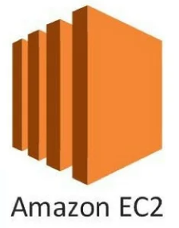

# ParseNimbus: Cloud-based Document Processing System

ParseNimbus is a cloud-based document processing solution that not only manages various document types like invoices and contracts but also automates their review and categorization based on departmental needs. The primary purpose of the project is to streamline the document handling process by leveraging AWS services and Python automation. Once a document is uploaded, the system processes it and extracts key information relevant to the respective department. 

For example, when handling documents for the Finance department, the system focuses on extracting crucial data such as the amount to be paid, the vendor’s account number, and the vendor’s name. All other details are secondary. This precise focus ensures that the relevant information is quickly identified and saved in the cloud, enhancing the efficiency of the document review process.

The infrastructure for ParseNimbus is set up using Terraform scripts, allowing for a seamless, automated, and scalable cloud environment. By using services like Amazon S3 for secure storage, EC2 for compute resources, Textract for data extraction, and SQS for asynchronous communication, ParseNimbus ensures an efficient and organized approach to document management. The combination of these services, along with Python automation, enables the application to be adaptable to different document types and departmental needs, providing an effective solution for businesses that require rapid and accurate document processing.

## Key Features of ParseNimbus

### <strong>End-to-End Automation of Document Processing</strong> 

ParseNimbus automates the entire document workflow, from uploading to processing, extracting key data, and saving the results. For example, the Finance department focuses on essential information like the vendor's name, account number, and payment details, while the system handles everything else automatically.

This boosts operational efficiency by eliminating manual steps and reducing human error. It also allows employees to focus on critical tasks while the system processes documents in the background.

### <strong>Department-Specific Data Extraction</strong> 

ParseNimbus tailors document processing for each department. For instance, the Finance department extracts payment-related data, while other departments can configure their own data needs, such as legal clauses for contracts.

This customization ensures that each department receives only relevant information, reducing data overload and improving accuracy across different workflows.

### <strong>Scalable Processing</strong> 

ParseNimbus can easily scale to handle increasing document volumes, whether processing a single document or thousands. The system adapts to demand without affecting performance.

This scalability ensures the system remains efficient as your organization grows, handling more documents without additional configuration.

ParseNimbus can easily scale to handle increasing document volumes, whether processing a single document or thousands. The system adapts to demand without affecting performance.

### <strong>Cloud Integration</strong> 

With tight integration of cloud services like S3, EC2, and Textract, ParseNimbus ensures reliable document storage, secure credential management, and on-demand computing resources for high availability and performance.

This cloud-native approach leverages scalable resources and ensures that all document processing is secure, reliable, and adaptable to changing needs.

### <strong>Flexible and Extensible</strong> 

ParseNimbus is built for easy customization. As business needs change, new workflows or document types can be added without disrupting existing processes.

This flexibility ensures the system can evolve with the business, allowing for future expansions and integrations with minimal effort.

### <strong>Efficient Document Retrieval</strong> 

Processed documents are organized in department-specific folders for easy retrieval. Users can quickly access processed data (e.g., finance_data.json) for review and download.

This organization simplifies the review process and improves productivity by ensuring that processed data is readily accessible.

## Project Tech-Stack

&nbsp;
&nbsp;
&nbsp;
&nbsp;
&nbsp;

## Command Execution

After the whole infrastructure of aws is set-up using the `main.tf` script, here are the commands that I have executed one-by-one for managing and using the services.

### ssh into the aws ec2 instance

`ssh -i parsenimbus_ec2_keypair.pem ubuntu@<public_ip_of_ubuntu_instance>`

### Install python3 and Pip

`sudo apt install python3 python3-pip`

### Set Up Python Virtual Environment

`python3 -m venv myenv`
`source myenv/bin/activate`

### Install the aws cli on the ec2 instance

`curl "https://awscli.amazonaws.com/awscli-exe-linux-x86_64.zip" -o "awscliv2.zip"`

* ##### Unzip the installer

`sudo apt-get install unzip -y`

* ##### Run the AWS CLI installer

`sudo ./aws/install`

* ##### Verify the Installation

`aws --version`

### Configure AWS CLI

`aws configure`
###### Enter your AWS Access Key ID, AWS Secret Access Key, Default region, and Default output format when prompted,using the IAM role and in the Users section, generate the access keys

### Activate Virtual Environment

`source myenv/bin/activate`

### Install dependencies like boto3 inside the python virtual environment

`pip install boto3`

### Make python script named `document_processing.py`

`vim document_processing.py`

######	After creating the .py script, paste the code provided in the github repository.

### Upload the pdf file to the s3 bucket

`aws s3 cp SampleInvoice.pdf s3://parsenimbus-s3-bucket-2184/`

### Send message to the SQS Queue

`aws sqs send-message --queue-url https://sqs.us-east-1.amazonaws.com/3240XXXXX890/document-processing-queue_2184 \ --message-body "{\"bucket_name\":\"parsenimbus-s3-bucket-2184\", \"file_key\":\"SampleInvoice.pdf\"}" --region us-east-1`

### Run the Document Processing Script

`python3 document_processing.py`

### Verify the processed data in the s3 bucket

`aws s3 ls s3://parsenimbus-s3-bucket-2184/processed/finance/`

### Download the Processed Data

`aws s3 cp s3://parsenimbus-s3-bucket-2184/processed/finance/finance_data.json`

### View the Processed Data

`cat finance_data.json`
## Execution Flow

* #### Document Upload
&nbsp;&nbsp;&nbsp;&nbsp;&nbsp;&nbsp;&nbsp;Document Upload: A document (e.g., `SampleInvoice.pdf`) is uploaded to the S3 bucket (`parsenimbus-s3-bucket-2184`).

* #### SQS Message sent
&nbsp;&nbsp;&nbsp;&nbsp;&nbsp;&nbsp;&nbsp;A message is being sent to the SQS queue document-processing-queue_2184 with a bucket and file key of the uploaded document.

* #### Transaction processing:
&nbsp;&nbsp;&nbsp;&nbsp;&nbsp;&nbsp;&nbsp;The `document_processing.py` script runs on an EC2 instance.
It retrieves the SQS message, downloads a document from an S3 bucket, and then processes it through AWS Textract or similar tools.
The extracted data is converted into department-specific outputs, such as the finance department seeing amount and vendor information.

* #### Save Processed Data
&nbsp;&nbsp;&nbsp;&nbsp;&nbsp;&nbsp;&nbsp;The processed data (e.g., `finance_data.json`) are stored back in a different location in the S3 bucket (`processed/finance/`).

* #### Deletion of SQS Message
&nbsp;&nbsp;&nbsp;&nbsp;&nbsp;&nbsp;&nbsp;The SQS message is deleted after processing the document, hence complete work task.

## Results

The input to the system is a document, typically an invoice, in PDF format. For this demonstration, the input file is named `SampleInvoice.pdf` which is also attached in this repository. This document contains standard invoice information such as the vendor's name, account number, total amount to be paid, product, quantity and amount per unit.

Once the document is uploaded to the S3 bucket, it is queued for processing via Amazon SQS and passed to AWS Textract for automated text extraction. The application returns a structured JSON file containing the extracted, department-specific data. For this case (finance department), the relevant output includes `Vendor Name`, `Account Number` and `Total Amount` 

